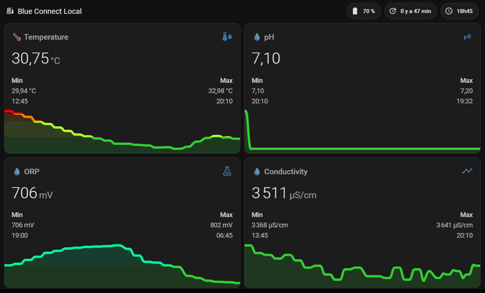

[](README.md) [](#)

# Blue Connect Local pour Home Assistant 🐬
[](https://github.com/hacs/integration)
[](https://github.com/Adrien40/ha-blue-connect-local/releases)
[](LICENSE)
[](https://github.com/Adrien40/ha-blue-connect-local/actions/workflows/tests.yaml)
[](https://github.com/Adrien40/ha-blue-connect-local/actions/workflows/hacs.yaml)
[](https://github.com/Adrien40/ha-blue-connect-local/actions/workflows/hassfest.yaml)
[](https://github.com/Adrien40/ha-blue-connect-local/actions/workflows/ruff.yaml)
[](https://github.com/Adrien40/ha-blue-connect-local/actions/workflows/mypy.yaml)
[](custom_components/blue_connect_local/quality_scale.yaml)

Si ce projet vous est utile, vous pouvez soutenir son développement 🙏

<a href="https://www.buymeacoffee.com/adrien40"></a>

---

## ⚡ En résumé
- 🔌 Fonctionnement 100 % local via Bluetooth (BLE)
- 🏠 Compatible Home Assistant (sans cloud)
- 🏷️ Détection Automatique du modèle (Gold / Silver)
- 🧪 **Bêta** : support expérimental des sondes au profil Blueriiot (voir *Compatibilité*)
- 🌡️ Mesures : Température, pH, ORP Redox, Salinité, Conductivité, Batterie
- 🎯 Analyse Manuelle : Possibilité de forcer une nouvelle analyse de l'eau à la demande, à distance
- ⚖️ Statut de Flottaison
- 🔋 Optimisé pour préserver la batterie
- ⚙️ Installation via HACS en 2 minutes

---

## 📸 Exemples dans Home Assistant

### 📊 Visualisation

<p align="center">
  
</p>

<p align="center">
  <em>📊 Vue d’ensemble des données de la piscine dans Home Assistant</em>
</p>

---

### 🔍 Détails techniques

<p align="center">
  
</p>

<p align="center">
  <em>🔍 Entités exposées par l’intégration & ⚙️ Options de Configuration avancées</em>
</p>

---

Une **intégration 100% locale pour Home Assistant** qui transforme votre analyseur Blue Connect en capteur Bluetooth Low Energy (BLE), afin de piloter et surveiller votre piscine sans aucune dépendance au Cloud. 🛡️

> ⚠️ **Avertissement** : Cette intégration interroge le Blue Connect directement en Bluetooth.

### 💡 Pourquoi cette intégration ?
Cette intégration libère votre Blue Connect du Cloud en exploitant directement son protocole BLE pour une gestion domotique sans compromis :

* **🔒 100 % local :** Fonctionne sans internet. Vos données transitent directement de la piscine à Home Assistant.
* **⏱️ Sans limite d'API :** Écoute passive des trames régulières et possibilité de forcer une mesure à la demande, sans aucune restriction.
* **🛡️ Pérennité :** Indépendance totale vis-à-vis des serveurs officiels, garantissant le fonctionnement de votre matériel sur le long terme.

**Blue Connect Local** est le fruit d'un travail de **Reverse Engineering** approfondi pour transformer votre analyseur en un véritable capteur industriel local, capable de communiquer directement avec votre instance Home Assistant.
Blue Connect Local permet de remplacer le cloud par une solution de **local control**, tout en offrant un système fiable de **pool monitoring** basé sur un **BLE sensor**.

---

### ✅ Compatibilité / Prérequis
* 🏷️ **Modèles supportés** : ZODIAC Blue Connect (Gold / Silver) avec **détection et adaptation automatiques** des capteurs (Conductivité et Salinité).
* 🏅 **Testé sur** : Validé sur le **ZODIAC Blue Connect Gold et Silver**.
* 🧪 **Sondes au profil Blueriiot (bêta)** : support expérimental depuis **1.3.0-beta.1**. L'intégration détecte le profil GATT Blueriiot lors de la connexion et décode la température, le pH, le Redox (ORP), la conductivité, la salinité et la batterie. **Mode Actif uniquement** (code d'accès requis). Pas encore validé par le mainteneur sur du vrai matériel : vos retours sont les bienvenus.
* 🔑 **Code d'Accès (Optionnel)** : Le code d'accès à 9 caractères de votre appareil. S'il n'est pas obligatoire pour l'écoute passive, il est **indispensable** pour les analyses à la demande.
* 🛠️ **Matériel requis** : Adaptateur Bluetooth interne, clé USB Bluetooth ou **Bluetooth Proxy ESPHome** (Fortement recommandé, [installation facile ici](https://esphome.github.io/bluetooth-proxies/)).
* 📶 **Qualité du signal** : Un signal RSSI stable (idéalement **supérieur à -75 dBm**) est indispensable pour garantir la connexion au Blue Connect. Les tests montrent qu'un signal inférieur à -90 dBm entraîne des échecs de lecture fréquents.
* ⏱️ **Surveillance en temps réel** : Une entité `sensor.*_signal_bluetooth` exploite l'écoute passive de Home Assistant pour vous permettre de surveiller la force du signal en direct, le tout sans drainer la batterie du Blue Connect !

> 🧪 **Les versions Blueriiot** ne sont supportées que dans les pré-versions **1.3.0-beta**. La version stable (1.2.x) ne les supporte pas.

---

### ✨ Points forts
* 🏠 **100% Local (BLE)** : Aucune dépendance au Cloud, pas d'abonnement, pas de latence.
* 🏷️ **Détection intelligente du modèle** : Identification automatique de votre variante (Gold ou Silver) en mode actif comme en mode passif. Les capteurs de conductivité et de salinité sont automatiquement activés ou désactivés selon votre sonde matérielle.
* 🌡️ **Remontée des capteurs bruts** : Température, pH, ORP (Redox), Salinité, Conductivité, Batterie (%).
* 🚀 **Analyse en temps réel** : Lancez une mesure manuelle quand vous le souhaitez.
* 🧪 **Intelligence Chimique Avancée** :
  * Calcul de l'**Indice de Langelier** (ISL) pour déterminer si l'eau est équilibrée, entartrante ou corrosive.
* 🟤 **Support Multi-Traitements** : Prise en charge du **Brome** (désactive automatiquement l'entité CyA, non pertinente pour ce traitement) et des piscines sans stabilisant (CYA = 0). Le type de traitement et le taux de CyA sont conservés pour un usage futur : **aucune valeur calculée n'en dépend pour le moment**.
* ⚙️ **Configuration 100% UI** : Découverte automatique Bluetooth, calibrage des sondes et réglage des seuils d'alerte directement depuis l'interface Home Assistant (aucun YAML requis).
* 🔄 **Modes de Synchronisation** : Mode Passif (écoute silencieuse préservant la batterie) et Mode Actif (analyses Bluetooth à la demande via le code d'accès).
* ⏱️ **Analyses planifiées sur des créneaux fixes** (Mode Actif) : réglez un **Intervalle d'Analyse** et une **Heure de Référence** ; les analyses tombent aux mêmes heures chaque jour au lieu de suivre un intervalle glissant (voir *Analyses planifiées* plus bas).
* 🌍 **Multi-langue** : Développé en Français 🇫🇷 et disponible en EN, ES, DE, IT, NL, PL, PT, PT-BR, SV, RU, ZH-HANS, ZH-HANT, CS, HU, EL, HR, DA, NB (Traduction via IA).

---

### 🚀 Installation

#### Via HACS (Recommandé)
Ce dépôt n'étant pas (encore) dans la liste officielle par défaut, vous devez l'ajouter en tant que dépôt personnalisé.

1. Ouvrez **HACS** dans votre Home Assistant.
2. Cliquez sur les 3 petits points en haut à droite et sélectionnez **Dépôts personnalisés**.
3. Dans **Dépôt**, collez l'URL : `https://github.com/Adrien40/ha-blue-connect-local`
4. Dans **Type**, choisissez **Intégration** puis cliquez sur **Ajouter**.
5. Une fois ajouté, une fenêtre apparaît : cliquez sur **Télécharger** (sélectionnez la dernière version).
6. **Redémarrez complètement Home Assistant**.
7. Allez dans **Paramètres** > **Appareils et Services** > **Ajouter une intégration** et cherchez « Blue Connect Local ».

### Manuelle
Copiez le dossier `custom_components/blue_connect_local` dans le dossier `custom_components` de votre configuration Home Assistant, puis redémarrez.

---

### 🗑️ Suppression
1. Allez dans **Paramètres** > **Appareils et services**, trouvez votre appareil Blue Connect, cliquez sur les 3 points et choisissez **Supprimer**. Cela retire toutes les entités et arrête l'écoute/l'interrogation Bluetooth.
2. Si installé via HACS : ouvrez **HACS**, trouvez **Blue Connect Local**, cliquez sur les 3 points et choisissez **Supprimer**.
3. Si installé manuellement : supprimez le dossier `custom_components/blue_connect_local`, puis redémarrez Home Assistant.

La suppression de l'intégration efface aussi son historique stocké localement (dernières valeurs connues, points de référence de calibration, code d'accès). Si vous voulez seulement mettre les mesures en pause sans perdre ces données, utilisez plutôt l'interrupteur **Analyses Automatiques**

---

### 📊 Capteurs et Contrôles disponibles
| Entité | Unité / Type | Description |
| :--- | :--- | :--- |
| 💧 **pH** | pH | pH calculé (Nernst + Compensation thermique). |
| ⚡ **Redox / ORP** | mV | Potentiel d'oxydoréduction. |
| 🌡️ **Température** | °C | Température précise de l'eau. |
| 🧂 **Salinité** | g/L | Salinité de l'eau (activée automatiquement sur Blue Connect Gold). |
| 🧪 **Conductivité** | µS/cm | Conductivité électrique de l'eau (activée automatiquement sur Blue Connect Gold). |
| ⚖️ **Indice de Langelier** | ISL | Indicateur d'équilibre de l'eau (Corrosive, Équilibrée ou Entartrante). |
| 🎯 **pH d'Équilibre** | pH | Cible du pH idéal calculé selon la Balance de Taylor. |
| 🔋 **Batterie** | % et mV | Niveau de charge (%) et tension brute de la pile. |
| 📶 **Signal RSSI** | dBm | Force du signal Bluetooth reçu en temps réel. |
| 🔵 **État Bluetooth** | Statut | État détaillé de la connexion (Connecté, En veille, Erreur...). |
| ⏱️ **Prochaine Analyse** | Horodatage | Heure estimée de la prochaine relève de données. |
| 🚀 **Nouvelle Analyse** | Bouton | **Lancer une analyse instantanée (~60s).** |
| ⏸️ **Analyses Automatiques** | Interrupteur | Activer/Désactiver la relève automatique (Mode Pause). |
| 🔄 **Intervalle d'Analyse** | Réglage (min) | Durée entre deux analyses planifiées (5 – 1440), Mode Actif. |
| 🕒 **Heure de Référence** | Réglage (heure) | Heure sur laquelle les créneaux d'analyse sont calés (08:00 par défaut). |
| 📡 **Analyses Internes du Blue Connect (Passives)** | Interrupteur | Utiliser les relevés que la sonde émet d'elle-même. |
| 💧 **TAC / TH / TDS / CyA** | Réglages (mg/L, ppm) | Paramètres de l'eau utilisés pour l'indice de Langelier et le pH d'équilibre (le CyA est conservé pour un usage futur). |

> 🛠️ **Fiche appareil & Diagnostic** : Le **Numéro de Série**, le **Numéro de Modèle (SKU)** et l'**Adresse MAC** sont nativement intégrés dans l'en-tête de l'appareil Home Assistant. L'intégration expose également des capteurs de diagnostic avancés (pH brut, Redox brut en mV, trame hexadécimale complète, statut de flottaison et alertes binaires).

> ℹ️ **Sur Blue Connect Silver** (sans sonde de conductivité) : les entités Conductivité et Salinité sont désormais désactivées automatiquement. Si vous avez mis à jour une installation existante où Conductivité était déjà présente, l'intégration détecte le modèle Silver et désactive ces entités elle-même — aucune action manuelle requise.

---

### 🧪 Expertise Chimique : Une analyse de niveau Professionnel

👉 Pas besoin de comprendre ces calculs : tout est automatisé dans Home Assistant.

<details>
<summary>🔬 Voir les détails scientifiques</summary>

#### Équilibre de l'eau : Indice de Saturation de Langelier & Balance de Taylor ⚖️
L'Indice de Saturation de Langelier (ISL) est le complément indispensable de la **Balance de Taylor**. Il permet de vérifier si votre eau est :
* **Corrosive (ISL < -0.3)** : L'eau attaque vos joints, liner et métaux.
* **Équilibrée (ISL entre -0.3 et +0.3)** : L'eau parfaite.
* **Entartrante (ISL > +0.3)** : Risque de dépôts calcaires.

Renseignez votre TAC, TH et TDS dans les options, et Home Assistant calculera votre équilibre en direct selon la température lue par le Blue Connect !

</details>

---

### 🎯 Note sur la précision des mesures
Les valeurs affichées dans Home Assistant peuvent différer légèrement de celles de l'application officielle Blue Connect.

Blue Connect Local permet une calibration « haute précision ». Contrairement à l'application mobile qui utilise des valeurs fixes, notre intégration vous permet de saisir la valeur exacte de votre solution tampon (pH 7.02, 4.01, etc.) ajustée à la température lors de votre calibration. C'est cette rigueur scientifique qui peut créer un léger décalage, signe d'une mesure plus proche de la réalité de votre bassin. 🔬

---

## 🚀 Configuration
> ⚠️ Nécessite **Home Assistant 2026.3.0 ou plus récent** (première version livrée avec Python 3.14). Testé sur 2026.3.0 et 2026.9.

1. Allez dans **Paramètres** > **Appareils et services**.
2. L'intégration devrait détecter automatiquement votre Blue Connect si votre antenne Bluetooth est à portée. Sinon, cliquez sur **Ajouter une intégration** et recherchez **Blue Connect Local**.
3. Suivez les instructions à l'écran pour définir le type de traitement (Chlore, Brome) et le calibrage/décalage de vos sondes.

### ⚙️ Options, Calibrations et Alertes
Une fois l'appareil ajouté, vous pouvez cliquer sur **Configurer** ⚙️ pour :
* Ajuster les valeurs de vos solutions de calibration (pH 4, pH 7, Redox).
* Modifier les paramètres de votre eau (TAC, TH, TDS, Stabilisant) directement via les contrôles exposés.
* Régler l'**Intervalle d'Analyse** et l'**Heure de Référence** (section ⏱️ *Synchronisation*), voir *Analyses planifiées* plus bas.
* Définir vos **seuils d'alerte personnalisés** (pH Min/Max, ORP Min/Max, etc.) pour piloter vos propres automatisations.

> Retrouvez la procédure pas à pas (pH brut / Redox brut, ajustement selon la température et Seuils d'Alerte) dans le **[Guide de Calibration](calibration_help.fr.md)**. Les notes de version sont dans le **[Journal des modifications](CHANGELOG.fr.md)**.

### ⏱️ Analyses planifiées (Mode Actif)
Quand un **Code d'Accès** est renseigné (Mode Actif), les analyses automatiques ne se déclenchent pas « toutes les N minutes après la précédente » : elles sont calées sur des **créneaux fixes**, ce qui donne des relevés à des heures prévisibles, quoi qu'il se soit passé avant (redémarrage, analyse manuelle, erreur).

| Réglage | Défaut | Plage | Rôle |
| :--- | :--- | :--- | :--- |
| 🔄 **Intervalle d'Analyse** | 60 min | 5 – 1440 min | Durée entre deux analyses planifiées. |
| 🕒 **Heure de Référence** | 08:00 | HH:MM | Heure sur laquelle les créneaux sont calés. |

* **Exemple** : avec un intervalle de **120 min** et une heure de référence de **08:00**, les analyses ont lieu à 08:00, 10:00, 12:00, 14:00… (et 06:00, 04:00… avant).
* **Où les modifier** : **Configurer** ⚙️ > section **⏱️ Synchronisation**, ou directement depuis les entités **Intervalle d'Analyse** et **Heure de Référence** de l'appareil (catégorie configuration), par exemple sur un tableau de bord.
* **Prise en compte immédiate** : la prochaine analyse est replanifiée dès que vous changez l'un des deux réglages.
* **Conseil** : choisissez un intervalle qui divise 24 h en parts égales (5, 10, 15, 20, 30, 60, 120, 180, 240, 360, 480, 720 ou 1440 min). Sinon les créneaux se décalent d'un jour à l'autre, car ils sont recalés chaque jour sur l'Heure de Référence.
* Un créneau situé à moins de 10 secondes est ignoré au profit du suivant.
* **Nouvelle Analyse** (nécessite un code d'accès) s'exécute immédiatement et ne modifie pas la planification.
* **Analyses Automatiques** désactivées : les analyses planifiées sont ignorées. Les réactiver ne lance **pas** d'analyse par elles-mêmes ; la suivante a lieu au prochain créneau (ou appuyez sur **Nouvelle Analyse**).
* **Sans code d'accès (Mode Passif)**, il n'y a pas de planification : Home Assistant utilise les relevés que la sonde émet d'elle-même, environ un par heure.

---

### 🐛 Dépannage

<details>
<summary>⚠️ Voir les problèmes fréquents</summary>
  
* **Erreurs Bluetooth fréquentes** : L'intégration gère automatiquement les tentatives de connexion. Si le capteur indique `Signal Perdu`, le Blue Connect est hors de portée. Rapprochez votre antenne ou [installez un Proxy Bluetooth ESPHome](https://esphome.github.io/bluetooth-proxies/) au plus près du bassin (nécessite juste un ESP32 (~10€) et un chargeur USB).
* **Code d'Accès invalide** : L'intégration vérifie votre code d'accès dès la connexion, donc s'il est erroné vous verrez `Invalid access code` sur le capteur d'état Bluetooth en quelques secondes — inutile d'attendre le timeout complet de l'analyse. Home Assistant vous propose aussi de le ressaisir via une notification **Ré-authentifier** ; vous pouvez également le corriger dans **Configurer ⚙️**, une analyse se déclenche automatiquement dès l'enregistrement.

</details>

---

### 🎯 Cas d'usage
* **Automatisation de sécurité piscine** : déclenchez une notification ou coupez la pompe de filtration si le pH ou le Redox sort de votre plage de sécurité, grâce aux capteurs binaires `Statut pH` / `Statut Redox (ORP)`.
* **Protection contre le gel** : combinez le capteur binaire `Statut Température` avec une automatisation de chauffage ou de volet lorsque les températures d'hiver approchent de zéro.
* **Rappels de dosage** : utilisez le capteur Statut de l'Indice de Langelier pour être prévenu quand votre eau devient corrosive ou entartrante, avant qu'elle n'abîme votre équipement.
* **Surveillance passive seule** : sans code d'accès, Blue Connect Local fournit tout de même une lecture par heure à partir des émissions de la sonde — utile si vous ne souhaitez pas d'analyses à la demande.

### 🤖 Exemples d'automatisations

<details>
<summary>📋 Notifier quand le pH sort de la plage</summary>

```yaml
automation:
  - alias: "pH piscine hors plage"
    trigger:
      - platform: state
        entity_id: binary_sensor.blue_connect_ph_status
        to: "on"
    action:
      - action: notify.mobile_app_votre_telephone
        data:
          title: "⚠️ Alerte pH piscine"
          message: "Le pH est actuellement {{ states('sensor.blue_connect_ph') }}, hors de la plage configurée."
```
</details>

<details>
<summary>📋 Alerter si la sonde n'a pas donné signe de vie depuis longtemps</summary>

```yaml
automation:
  - alias: "Blue Connect injoignable trop longtemps"
    trigger:
      - platform: event
        event_type: repairs_issue_registry_updated
        event_data:
          action: create
          domain: blue_connect_local
    action:
      - action: notify.mobile_app_votre_telephone
        data:
          title: "🔌 Blue Connect injoignable"
          message: "La sonde Blue Connect n'a pas répondu depuis un moment. Vérifiez sa pile et la portée Bluetooth."
```
</details>

### ⚠️ Limitations connues
* **Portée Bluetooth** : comme tout appareil BLE, le Blue Connect doit rester à portée d'un adaptateur Bluetooth ou d'un [proxy ESPHome](https://esphome.github.io/bluetooth-proxies/). Une bâche épaisse, la distance et les structures métalliques peuvent affaiblir le signal.
* **Pas de notification poussée depuis la sonde** : hors analyses à la demande, les données sont rafraîchies selon les créneaux planifiés (Mode Actif) ou quand la sonde émet son propre relevé, environ une fois par heure (Mode Passif), pas en flux continu.
* **Le Redox (ORP) n'est pas une mesure de chlore** : il reflète le pouvoir oxydant de l'eau (pH, température, stabilisant, vieillissement de la sonde), pas une concentration. Utilisez la valeur Redox brute avec vos propres seuils et un kit d'analyse pour le taux de chlore réel.
* **Une sonde par entrée** : si vous possédez plusieurs Blue Connect, ajoutez chacune comme une entrée d'intégration distincte.
* **Le matériel Blueriiot est expérimental (bêta uniquement)** : Mode Actif uniquement, sans numéro de série, modèle (SKU) ni état du flotteur, car ils viennent de caractéristiques propres aux ZODIAC. La version stable ne supporte que les ZODIAC Blue Connect Gold/Silver d'origine.

---

### 🤝 Contributions & Support
Pour tout bug ou demande d'amélioration, merci d'ouvrir une [Issue](https://github.com/Adrien40/ha-blue-connect-local/issues) sur ce dépôt.

### ⚠️ Avertissement (Disclaimer)
Cette intégration est un projet indépendant. Elle n'a aucun lien, de près ou de loin, avec l'entreprise FLUIDRA/ZODIAC. L'utilisation de ce logiciel se fait sous votre propre responsabilité.

### ⚖️ Licence
Projet sous licence **GPLv3**. Indépendant de la société FLUIDRA. Utilisation sous votre entière responsabilité.

---

**Développé avec ❤️ par @Adrien40**

<a href="https://www.buymeacoffee.com/adrien40"></a>

<!-- Keywords: Home Assistant custom integration, BLE sensor, pool monitoring, local control -->
