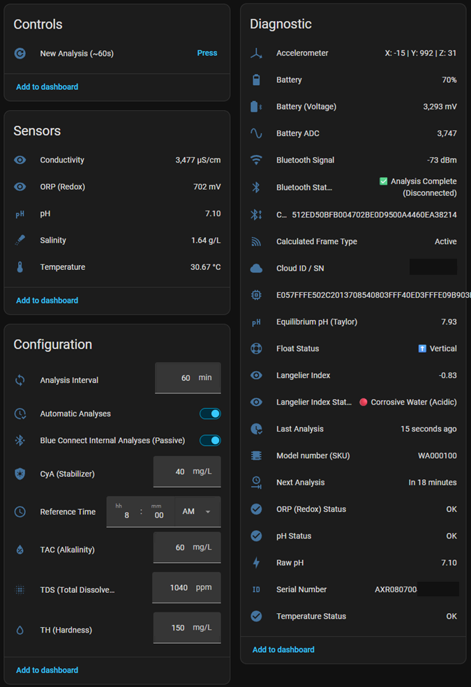

[](README.fr.md) [](#)

# Hydrao Custom for Home Assistant 🚿
[](https://github.com/hacs/integration)
[](https://github.com/Adrien40/ha-hydrao-custom/releases)
[](LICENSE)
[](https://github.com/Adrien40/ha-hydrao-custom/actions/workflows/tests.yaml)
[](https://github.com/Adrien40/ha-hydrao-custom/actions/workflows/hacs.yaml)
[](https://github.com/Adrien40/ha-hydrao-custom/actions/workflows/hassfest.yaml)
[](https://github.com/Adrien40/ha-hydrao-custom/actions/workflows/ruff.yaml)
[](https://github.com/Adrien40/ha-hydrao-custom/actions/workflows/mypy.yaml)
[](custom_components/hydrao_custom/quality_scale.yaml)

A **100% local integration for Home Assistant** that talks directly over Bluetooth Low Energy (BLE) with your Hydrao shower device, to track your water usage shower after shower, with zero Cloud dependency. 🛡️

> ℹ️ **Good to know**: This integration queries the Hydrao device directly over Bluetooth while the water is running — that's what lets it read data and send settings live to the device.

If this project is useful to you, you can support its development 🙏

<a href="https://www.buymeacoffee.com/adrien40"></a>

---

## ⚡ At a Glance
- 🔌 100% local operation over Bluetooth (BLE)
- 🏠 Home Assistant compatible (no cloud)
- 🚿 Detailed tracking for every shower: Volume, duration, wasted cold-water volume
- 🔄⭐ Comfort Mode Sync: Automatically resets the device's counter as soon as the water reaches the defined Minimum Comfort Temperature
- 🎨 Set the 4 liter thresholds and pick their colors via a built-in color picker
- 🌡️ Minimum Comfort Temperature adjustable in Home Assistant (never sent to the Hydrao device)
- 🔘 "Shower Ended" button to manually close out a shower or trigger it via an automation (e.g. Hey Google, Shower Ended "Name") — <sub>an `input_boolean` may be needed to link it to Google Assistant</sub>
- ⚙️ HACS installation in 2 minutes

---

## 📸 Examples in Home Assistant

### 🔍 Technical Details

<p align="center">
  
</p>

<p align="center">
  <em>🔍 Entities exposed by the integration & ⚙️ Advanced configuration options</em>
</p>

---

### 💡 Why This Integration?
This integration talks directly to your Hydrao's BLE protocol for complete home-automation tracking, with no compromises:

* **🔒 100% local:** No internet connection required, data flows only from the shower to Home Assistant.
* **🚿 Precise per-shower tracking:** Volume, duration, and — most importantly — the cold-water volume wasted before the water reaches the right temperature.
* **🔄 Comfort Mode Sync:** Restarts the counter on the device as soon as the Minimum Comfort Temperature is reached, so the liter and color thresholds only reflect water that was actually comfortable — and therefore actually used.
* **🛡️ Longevity:** No dependency on a server or third-party app.

---

### ✅ Compatibility / Requirements
* 🏠 **Home Assistant**: version **2026.5.0 or newer** (the integration relies on a Bluetooth helper first shipped in that release).
* 🏷️ **Supported models**: Hydrao devices broadcasting over Bluetooth (BLE) under an automatically detected name (`HYDRAO*`).
* 🏅 **Tested on**: Validated on the **Hydrao Aloé (HYDRA_SHOWER)**, Hardware version 9.
* 🛠️ **Required hardware**: Built-in Bluetooth adapter, USB Bluetooth dongle, or an **ESPHome Bluetooth Proxy** (recommended for range, [easy setup here](https://esphome.github.io/bluetooth-proxies/)).
* 💧 **Waking the device**: The Hydrao only communicates over Bluetooth while water is running — remember to run the water so the integration can read or write settings (thresholds, colors, soaping time).
* 📶 **Bluetooth signal**: A dedicated RSSI sensor lets you monitor signal quality live.

---

### ✨ Highlights
* 🔄⭐ **Comfort Mode Sync** (Switch): Automatically resets the device's counter as soon as the water reaches the defined Minimum Comfort Temperature — the flagship feature of this integration.
* 🏠 **100% Local (BLE)**: No Cloud dependency.
* 💧 **Detailed volumes**: Total cumulative volume, current shower volume, comfort volume, wasted volume (cold water) — both per session and cumulative total.
* ⏱️ **Detailed durations**: Duration of the current shower, time spent in the comfort zone, time spent in cold water, and time needed to reach comfort temperature.
* 🎨 **Thresholds & Colors**: Set the 4 liter thresholds and pick their colors via a built-in color picker, read and updated live on the device.
* 🌡️ **Minimum Comfort Temperature**: Adjustable in Home Assistant via a Number entity, with a validated range (0 - 50 °C) — this setting stays in Home Assistant and is never sent to the Hydrao device.
* 🧴 **Maximum Soaping Time**: Duration before the counters reset, adjustable (10 to 600 seconds).
* 🔘 **"Shower Ended" button**: Manually ends the current count without waiting for the water to shut off. <sub>Tip: an `input_boolean` may be needed to link this button to Google Assistant.</sub>
* 🔵 **Detailed Bluetooth status**: Water Off, Connecting, Connected, Error, Sending Configuration, Configuration Applied, Failed, or Restarting Device.
* 📋 **Pending Configuration**: Shows at a glance whether any settings (thresholds, colors, soaping time) haven't been sent to the device yet.
* 📶 **Live Bluetooth signal** via passive listening, without polling the device or draining its battery.
* 🔧 **Diagnostics**: Firmware, Hardware, and Unique Identifier of the device, exposed at the device level.
* ⚙️ **100% UI configuration**: Automatic Bluetooth discovery or manual setup by MAC address, everything is configured from the Home Assistant interface.
* 🔄 **Factory reset** available directly from the options.

---

### 🚀 Installation

#### Via HACS (Recommended)
Since this repository isn't (yet) in the official default list, you'll need to add it as a custom repository.

1. Open **HACS** in your Home Assistant.
2. Click the 3 dots in the top right and select **Custom repositories**.
3. In **Repository**, paste the URL: `https://github.com/Adrien40/ha-hydrao-custom`
4. In **Type**, choose **Integration**, then click **Add**.
5. Once added, a window appears: click **Download** (select the latest version).
6. **Fully restart Home Assistant**.
7. Go to **Settings** > **Devices & Services** > **Add Integration** and search for "Hydrao Custom".

#### Manual
Copy the `custom_components/hydrao_custom` folder into the `custom_components` folder of your Home Assistant configuration, then restart.

---

### 📊 Available Sensors and Controls
| Entity | Unit / Type | Description |
| :--- | :--- | :--- |
| 🔘 **Shower Ended** | Button | Manually ends the count for the current shower. |
| ⏱️ **Shower Duration** | s (displayed in min) | Raw duration of the current shower. |
| ⏱️ **Comfort Shower Duration** | s (displayed in min) | Time spent in the comfort zone. |
| ❄️ **Cold Water Shower Duration** | s (displayed in min) | Time spent below the comfort temperature, for the current shower. Diagnostic sensor, disabled by default. |
| ⏳ **Time to Comfort Temperature** | s (displayed in min) | Time elapsed before the comfort temperature was first reached. The value stays fixed once reached, even if the water cools down again later. Unavailable until it is reached, or if the water was already warm when the connection was made. Diagnostic sensor, disabled by default. |
| 🌡️ **Temperature** | °C | Water temperature measured live. |
| 🚿 **Shower Volume** | L | Raw volume of the current shower. |
| 💧 **Comfort Shower Volume** | L | Volume used once the comfort temperature is reached, for the current shower. |
| 💧 **Total Cumulative Comfort Shower Volume** | L | Historical total of the volume used once the comfort temperature is reached. |
| 💧 **Total Cumulative Shower Volume** | L | Total volume accumulated since installation. |
| ❄️ **Wasted Volume (Cold Water)** | L | Volume wasted before reaching the comfort temperature, for the current shower. |
| ❄️ **Total Cumulative Wasted Volume** | L | Historical total of the wasted cold-water volume. |
| 🔄 **Comfort Mode Sync** | Switch | Enables automatic reset as soon as comfort is reached. |
| 🌡️ **Minimum Comfort Temperature** | Number (°C) | Adjustable comfort threshold (0 - 50 °C). |
| 📋 **Pending Configuration** | Status | Setting(s) awaiting delivery to the device (None, Soaping, Thresholds, Colors, or combinations). |
| 💨 **Flow Rate** | L/min | Instantaneous water flow rate. |
| 🧴 **Maximum Soaping Time** | s | Maximum soaping time currently configured, as read from the device. |
| 🔵 **Bluetooth Status** | Status | Water Off / Connecting / Connected / Error / Sending Configuration / Configuration Applied / Failed / Restarting Device. |
| 🟢🔵🩷🔴 **Threshold 1 to 4** | L | The 4 liter tiers configured on the device, with their color as an attribute. |
| 📶 **Bluetooth Signal** | dBm | Real-time received Bluetooth signal strength. Diagnostic sensor, disabled by default: enable it from the entity settings to check the Bluetooth range. |

ℹ️ *The device's Firmware, Hardware, and Unique Identifier are exposed by Home Assistant at the device level*

ℹ️ *The per-shower sensors (**Shower Volume**, **Comfort Shower Volume**, **Wasted Volume (Cold Water)**) restart from zero at every shower. For long-term statistics and the Water dashboard, use the **Total Cumulative** sensors instead.*

---

## 🚀 Configuration
1. Go to **Settings** > **Devices & Services**.
2. **If the water is running and the Hydrao device is in range**, Home Assistant detects it automatically: open the discovery notification and follow the wizard. **Otherwise**, click **Add Integration**, search for **Hydrao Custom**, then enter the device's MAC address manually.
3. Either way, you can set the Minimum Comfort Temperature at this step.

### ⚙️ Options
Once the device is added, click **Configure** ⚙️ to:
* Adjust the Minimum Comfort Temperature, Maximum Soaping Time, and Comfort Mode Sync.
* Change the 4 liter thresholds and their colors (only once a first connection has been established — run the water to wake the device).
* Reset to factory defaults in one click.

> ⚠️ **Water must be running** when you submit the form for the new thresholds to be sent to the device. If it isn't, the status will show **"🚰 Water Off"** and the setting will remain visible in the **Pending Configuration** sensor until the next shower — and if the transfer still fails once the water is back on, the integration will automatically retry on the following shower.

---

### 🔄 How Data Is Updated
The integration does **not poll** the device. It listens passively for the Hydrao's Bluetooth advertisements, which only appear **while water is running**:

* **Water starts:** Home Assistant sees the device, the integration connects and reads volume, duration, temperature and flow continuously for as long as the connection lasts. Entities are updated on every read, and **Bluetooth Status** shows *Connected (Shower in progress)*.
* **Water stops:** the connection ends. **Flow Rate** drops to 0, **Bluetooth Status** returns to *Water Off*, and the other sensors keep the values of the last shower.
* **New shower:** counters restart once the device has been silent for longer than the **Maximum Soaping Time**, when you press **Shower Ended**, or when **Comfort Mode Sync** resets them.
* **Settings you change** (thresholds, colors, soaping time) are queued and written at the next connection, so they show in **Pending Configuration** until the next shower.
* The **Bluetooth Signal** sensor updates on every advertisement received.

---

### 🎯 Use Cases
* **Cut wasted water:** see, shower after shower, how many liters of cold water run before the right temperature, and track the trend with the cumulative sensors.
* **Meaningful liter thresholds:** with **Comfort Mode Sync**, the colored tiers on the device only count water that was actually comfortable.
* **Shower presence:** use **Bluetooth Status** (*Connected*) as a "shower in progress" signal for the fan, the lights or the heating.
* **Voice or automation control:** end a shower or change the comfort temperature from a script, a dashboard, or a voice assistant.

---

### 🤖 Automation Examples
Replace the entity IDs below with yours (they start with your device's name, for example `sensor.hydrao_eeff_...`).

**Notify when a shower wasted too much cold water**
```yaml
automation:
  - alias: "Shower: wasted water report"
    triggers:
      - trigger: state
        entity_id: sensor.hydrao_eeff_bluetooth_status
        from: "success"
        to: "waiting"
    conditions:
      - condition: numeric_state
        entity_id: sensor.hydrao_eeff_wasted_volume_cold_water
        above: 5
    actions:
      - action: notify.notify
        data:
          message: >-
            {{ states('sensor.hydrao_eeff_wasted_volume_cold_water') }} L of
            cold water wasted during this shower.
```

**End the shower from an automation**
```yaml
actions:
  - action: button.press
    target:
      entity_id: button.hydrao_eeff_shower_ended
```

---

### ⚠️ Known Limitations
* **Water must be running** for the device to be reachable: nothing can be read or written otherwise. Settings changed while the water is off are delivered at the next shower.
* **Thresholds and colors** can only be edited after a first successful connection.
* The **Minimum Comfort Temperature** lives in Home Assistant only and is never sent to the Hydrao.
* **Time to Comfort Temperature** stays unavailable if the water was already warm when the connection was made.
* Only the **Hydrao Aloé (HYDRA_SHOWER)**, hardware version 9, has been tested. Other Hydrao models are expected to work but are not validated.
* Reliability depends on Bluetooth range: a weak signal can cause *Connection Error*; an [ESPHome Bluetooth Proxy](https://esphome.github.io/bluetooth-proxies/) near the shower helps.

---

### 🗑️ Removal
1. Go to **Settings** > **Devices & Services** and open **Hydrao Custom**.
2. Click the ⋮ menu next to your device and choose **Delete**. Home Assistant removes the device and its entities.
3. To remove the code as well: if you installed through HACS, open **HACS**, select **Hydrao Custom** and choose **Remove**; if you installed it manually, delete the `custom_components/hydrao_custom` folder. Then restart Home Assistant.

> ℹ️ Removing the integration does not change anything on the Hydrao itself: its thresholds, colors and soaping time stay as they were. To set them back to their defaults first, use **Reset to factory defaults** in the options (see above).

> ℹ️ The two cumulative sensors (**Total Cumulative Wasted Volume** and **Total Cumulative Comfort Shower Volume**) keep their totals in a file of their own in Home Assistant's `.storage` folder, which is included in Home Assistant backups. Deleting the device deletes that file too: if you add the device again, these totals start from 0.

---

### 🐛 Troubleshooting

<details>
<summary>⚠️ See common issues</summary>

* **"Water Off" permanently**: Normal — the Hydrao only communicates over Bluetooth while water is running.
* **Temperature shown as *Unknown* (and a warning in the log)**: the device sent a temperature that cannot be real (outside 0–100 °C), so the integration ignores it instead of counting it as hot water. Some Hydrao revisions may encode their values differently. Please [open an issue](https://github.com/Adrien40/ha-hydrao-custom/issues) and attach the diagnostics file (**Settings** > **Devices & Services** > **Hydrao Custom** > ⋮ > **Download diagnostics**): it contains the raw Bluetooth frames, the firmware and the hardware revision, which is what is needed to fix the decoding.
* **"Connection Error"**: Unlike "Water Off", this status means the device was detected in range, but the connection or read still failed (signal too weak or unstable, dropped mid-shower). Move your antenna closer, or [install an ESPHome Bluetooth Proxy](https://esphome.github.io/bluetooth-proxies/) near the shower.
* **"Configuration Failed"**: Writing the new settings to the device failed after several attempts. No need to worry: the change isn't lost (visible in **Pending Configuration**), it will be automatically retried at the next shower.
* **Thresholds/Colors greyed out in options**: They can only be read/edited after a successful first connection — run the water once before adjusting them.

</details>

---

### 🤝 Contributing & Support
For any bug or feature request, please open an [Issue](https://github.com/Adrien40/ha-hydrao-custom/issues) on this repository.

### ⚖️ License & Disclaimer
Project licensed under **GPLv3**. This is an independent project with no affiliation to the Hydrao company. Use of this software is at your own responsibility.

---

**Developed with ❤️ by @Adrien40**

<a href="https://www.buymeacoffee.com/adrien40"></a>

<!-- Keywords: Home Assistant custom integration, BLE sensor, water saving, shower monitoring, local control -->
